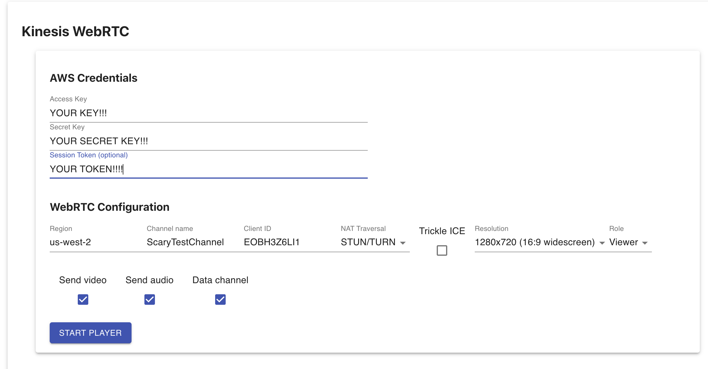

# AWS Kinesis Video WebRTC Demo in React

This project ports the [awslabs/amazon-kinesis-video-streams-webrtc-sdk-js](https://github.com/awslabs/amazon-kinesis-video-streams-webrtc-sdk-js) to React. 

The only additional dependencies I pulled in are [Material UI](https://material-ui.com/) for basic visual formatting to make things look a little nicer, and [react-easy-state](https://github.com/RisingStack/react-easy-state) which makes it dead simple to handle / share state between components.

## Demo

You can try this out in the browser at the link below:

https://matwerber1.github.io/aws-kinesisvideo-webrtc-react/



## Prerequisites

1. AWS account and IAM credentials (user or temporary role)
2. [Create a Kinesis Video signaling channnel in advance](https://docs.aws.amazon.com/kinesisvideostreams-webrtc-dg/latest/devguide/gs-createchannel.html)

## Deployment

1. Clone this project: 

  ```sh
  git clone https://github.com/matwerber1/aws-kinesisvideo-webrtc-react
  ```

2. From the project root directory, install NodeJS dependencies:

  ```sh
  npm install
  ```

3. Run the app!

  ```
  npm run start
  ```

4. In the browser (https://localhost:3000), enter your IAM credentials and the name of your KVS WebRTC signaling channel.

5. Start the player as a viewer or master.

6. You can open a separate tab or browser session and repeat the prior steps, except switch the role of the player so you have both a master and viewer. Or, if you run master in the browser, you can log in to your AWS account and use the built-in viewer in the Kinesis Video WebRTC/Signaling Channel console.
